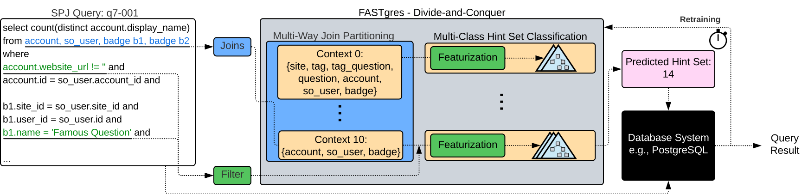

# FASTgres

This repository contains FASTgres, the learned model to enhance hint set prediction using context based gradient boosting. Currently, FASTgres is designed to evaluate a given workload. 

Note that this implementation is still in development and may be subject to change.

## Introduction

We shortly introduce FASTgres' architecture to reinforce the necessary steps when evaluating a workload.



FASTgres has an input workload that on which it is trained. Since FASTgres uses **supervised learning**, such a workload needs to be **labeled**. For evaluation purposes it is adviced to also label any traing set or simply the whole data set in advance.

To be able to encode each query (i.e., **featurization**), additional **database and workload statistics** have to be obtained.

Lastly, FASTgres can be run to obtain workload predictions that can then be evaluated.


Note that FASTgres does not support all commonly available workload at this moment, as it is still in a very early stage of development.
Currently supported workloads include Stack-Overflow [^1] and Join-Order-Benchmark [^2]. TPC-H [^3] has been evaluated but its support is currently disabled due to refactoring.

**TLDR:** FASTgres:
- Needs labeled data, and database and workload information
- Supports Stack, JOB, and TPCH (currently disabled)

## Project Structure

| Name | Description |
|------|-------------|
| db_info | Folder that contains information for each workload. Some pregenerated auxiliary information is already present. This is the folder in which the generated database information should reside |
| queries | Contains workload queries that are delivered with each workload. Stack queries have been split into contexts for further investigation if desired. TPC-H queries have been generated using scale factor 10. |
| bao_server_eval.py | Script to evaluate BAO on our architecture. **Optional**.|
| build_query_objects.py | Script used to build query objects to speed up query featurization during runtime. Needs database info to be build first. **Optional but recommended**. |
| config.ini | Configuration template that is accessed during most steps. Needs to be adapted to fit the current databases. Psycopg2-format. **Required**. |
| context_heuristic.py | Auxiliary file.|
| evaluate_queries.py | Main script. Used to evaluate workloads. Make sure your database info is present in `config.ini`, `update_db_info.py` and possibly `build_query_objects.py` have been run, and `generate_labels.py` has been run to create an archive.|
| featurize.py | Auxiliary file.|
| fill_eval_dict.py | Script to update unseen predictions within the query archive that is used for training. It is recommended to update the archive after each hint set prediction such that further analysis is improved and redundant query execution can be avoided. **Optional but recommended**.|
| generate_labels.py | Script to build an initial archive with labeled queries. Building large workload archives like for Stack (6191 queries) may take up days to be created, depending on your hardware, Postgres version, and database settings.  **Required**.|
| hint_sets.py | Auxiliary file. |
| query.py | Auxiliary file.|
| update_db_info.py | Script to build database information. Usually, `-mm`, `-l`, `-w` should be the `db_info/<-workload->` directory. **Required**.|
| utility.py | Auxiliary file.|

Examplary call using stack, precomputed query_objects, and no critical query detection:
```python3 evaluate_queries.py <path/to/all/queries/> -db stack -a <path/to/archive.json> -dbip <path/to/db_info/> -qo <path/to/query_objects.pkl> -cqd False -sd <dir/to/save/to/> -sp <path/to/train_test_split.json>```

After `evaluate_queries.py` has been run, predictions can be added to the archive using `fill_eval_dict.py`. 

**Note**: Keep in mind that when using the retraining option, FASTgres will naturally execute some query-hint-set combinations. This increases the runtime performance depending on hardware, configuration, ... . 

Using no retraining will result in FASTgres only using its initial predictions, which is way faster.

## Evaluation Environment

FASTgres was evaluated on PostgreSQL v12.4 for comparability to BAO [^1] and v14.6 as this version was the most up-to-date at the time of development.

We tested FASTgres on two hardware environments:


| OS | CPU | CPU Cores | Architecture | RAM | Storage |
|:--:|:---:|:---------:|:------------:|:---:|:-------:|
| CentOS 64-bit | Intel Xeon Gold 6216 | 12 | Skylake | 92 GiB | 1.8TB HDD |
| Windows 10 64-bit | Intel Xeon E-2186M | 6 | Coffee Lake| 64 GiB | 1.8 TiB NVMe SSD |


## Reproduce Results 

First you should ensure that you have PostgreSQL installed and a database like imdb or stack deployed. We recommend PostgreSQL 12 or 14 to minimize possible conflicts.

Afterwards, set the `config.ini` according to your connection data. A template is given in the file and needs to be adjusted accordingly.

Now we are ready to label your workload queries. An exemplary call with configs set for `stack_overflow` would be (replace parts in `<>` to fit your folder structure): 

```python3  generate_labels.py <path/to/queries/> -o <output/dir/save_name.json> -db stack```

This will build the labels of the given query path and database `stack` - a shortcut for the `stack_overflow` config, using the full set of six hints. The output label archive is then saved in the output path.

This procedure may take a while depending on your hardware environment and benchmark. Typically, JOB labels in a few hours while Stack may take days for an unrestricted amount of six hints. Using the reduced set of hints with ```-r True``` naturally reduces the search space drastically, allowing for faster labeling times.

Now we build the necessary database knowledge. We do so by running the following command, exemplary for stack again.

```python3 update_db_info.py stack -mm db_info/stack/ -l db_info/stack/ -w db_info/stack/ -q <path/to/all/queries/>``` 

Here, our save_path for min-max-dictionaries, label encoders and wildcard dictionaries coincide. Lastly, the query path is used to gather wildcard filter information used in the encoding.

Since we wish to speed-up our query evaluation later on, we build query objects in advance. Again, for a workload like stack, this call looks like this:

```python3 build_query_objects.py <path/to/all/queries/> -sp <path/to/save/dir/>```

This will build query objects beforehand and save their encoding time such that they are not neglected and can be considered afterwards.

Once this is done, we can run our evaluation. Exemplary for stack and using the default configurations of FASTgres, a call looks like this:

```python3 evaluate_queries.py <path/to/all/queries/> -db stack -a <path/to/archive.json> -dbip <path/to/db_info/> -qo <path/to/query_objects.pkl> -cqd False -sd <dir/to/save/to/> -sp <path/to/train_test_split.json>```

This will evaluate FASTgres on the given queries and the stack database using the archive generated by `generate_labels.py` and the database information generated by `update_db_info.py` as well as the additional query objects of `build_query_objects.py`. Lastly, for a fast evaluation, this example call switches off critical query detection with ```-cqd False``` and the successive retraining. Lastly, `-sd` and `-sp` provide paths for our train-test-split, encoding times, critical queries incl. their execution times (if applied), and predictions to be saved to.


## License

This software is available under the Apache License Version 2.0.

## References

[^1]: Marcus, Ryan, et al. "Bao: Making learned query optimization practical." Proceedings of the 2021 International Conference on Management of Data. 2021.
[^2]: Leis, Viktor, et al. "How good are query optimizers, really?." Proceedings of the VLDB Endowment 9.3 (2015): 204-215.
[^3]: [TPC-H](https://www.tpc.org/tpch/)
